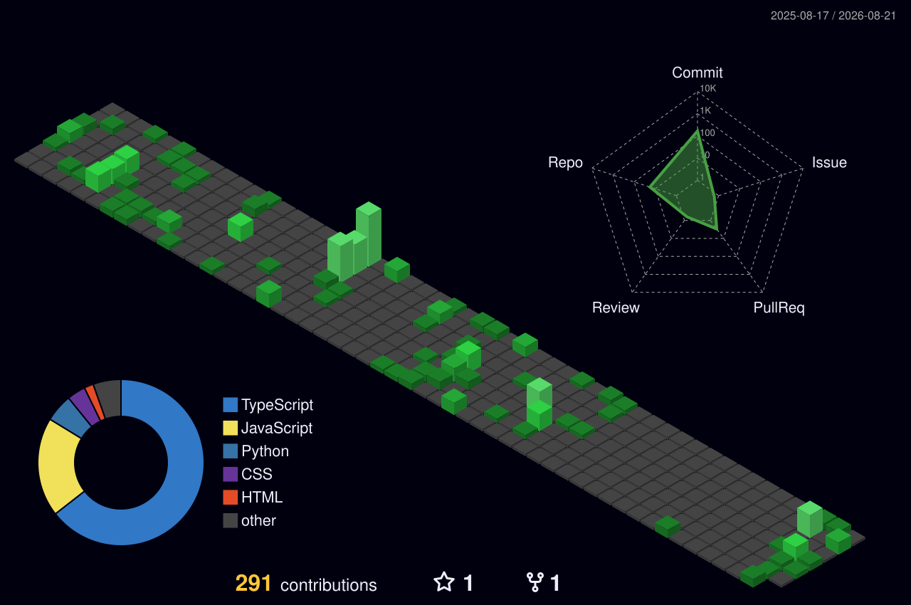

<!-- Animated Wave Header (Top Banner) -->


<div align="center">
  <!-- Animated Typing Bio (reliable fork, not the dead heroku one) -->
  
</div>

<div align="center">
  
  
</div>

<br/>

## 📊 Contribution Graph (3D)

<p align="center">
  
</p>

> Auto-updates daily via GitHub Actions — [see the workflow](.github/workflows/3d-contrib.yml)

---

## 🎯 About Me

```yaml
name: "Michael Obaniwa (Olumide Michael Obaniwa)"
role: "Full-Stack Developer, Entrepreneur & Project Manager"
location: "Lagos, Nigeria"
status: "CEO & Co-Founder @ UPCO Nigeria | Open to select collaborations"
education: "BSc Computer Science, Ambrose Alli University"
certifications:
  - "HubSpot Digital Marketing"
  - "Google Analytics (GA4)"
interests:
  - "EdTech, HealthTech & scalable web/mobile apps"
  - "Admin systems, dashboards & multi-portal platforms"
  - "AI-assisted tools and productivity workflows"
  - "Startup building, product strategy & fundraising"
values:
  - "Write code that is readable, testable, and maintainable"
  - "Ship, learn, iterate"
  - "Build things that solve real problems for real people"
```

- **🚀 What I do**: I build and run **full-stack web & mobile platforms** — from EdTech and school management systems to healthtech and fintech-adjacent tools — wearing both the founder and the developer hat.
- **🏢 Where I work**:
  - **CEO & Co-Founder**, [UPCO Nigeria](https://upco.live) — an EdTech platform for Nigerian job seekers, students, and entrepreneurs
  - **Project Manager & Developer**, [Springbase](https://springbase.com.ng) — a multi-portal school management platform (student, parent, admin dashboards)
  - **Project Manager & Web Developer**, ShopMaster
  - **Project Manager**, King of CMS Consulting — including work on Figora Health, a cross-border telehealth platform
  - **DevOps Engineer**, Life Analytics
  - **Mobile Developer**, Afretrade
- **🧠 How I think**: Strong focus on **clean architecture**, **shipping fast**, and **building for the user in front of me**, whether that's a student, a parent, or a job seeker.
- **🌍 Beyond code**: I enjoy exploring **online monetization models**, mentoring, and figuring out how to make ambitious products work with lean teams.

---

## 🛠️ Tech Stack

```json
{
  "languages": ["JavaScript", "TypeScript", "Python", "PHP", "Dart"],
  "frontend": ["React", "Next.js", "Flutter", "Tailwind CSS", "Bootstrap"],
  "backend": ["Node.js", "Express", "Django", "Laravel"],
  "databases": ["MySQL", "MongoDB", "Firebase", "Supabase"],
  "cms_&_nocode": ["WordPress", "Elementor"],
  "devOps_&_hosting": ["Vercel", "Render", "AWS (basics)"],
  "tools": ["Git", "GitHub", "Linux", "VS Code", "Cursor", "Figma"]
}
```

---

## 🧩 What I'm Currently Working On

- **Building**: [UPCO Nigeria](https://upco.live) — growing our EdTech platform, content, and community for Nigerian job seekers and entrepreneurs.
- **Maintaining**: [Springbase](https://springbase.com.ng) — a full-stack, multi-portal school management system (React, Node.js, MongoDB, Express, Tailwind CSS).
- **Exploring**: Application architecture, scalable multi-tenant systems, and go-to-market strategy for early-stage products.
- **Learning**: Deeper patterns for state management, API design, and fundraising for African startups.

---

## 🤝 Let's Connect

- **GitHub**: [@ObaniwaMichael](https://github.com/ObaniwaMichael)
- **Portfolio**: [kingmaker-ten.vercel.app](https://kingmaker-ten.vercel.app)
- **Open to**: strategic collaborations, freelance/contract projects, and MSc/research conversations.

If you're working on something exciting in EdTech, HealthTech, or scalable web platforms and need a developer who can also think like a founder, I'd be happy to chat.


